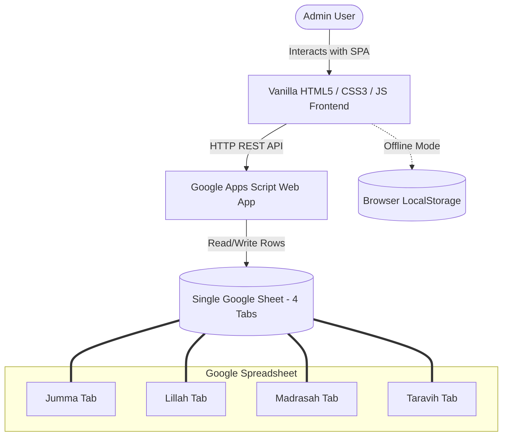

# Ihsanpark Masjid Hisab Module

This project details the architectural blueprint, database design, backend Apps Script code, and frontend logic required to build a standalone, lightweight Single Page Application (SPA) dashboard for tracking Masjid finances. It follows the exact design language, responsiveness, and Google Sheets real-time integration paradigm used in the [monthly-maintenance](file:///c:/Development/AD/monthly-maintenance) dashboard.

---

## 📊 System Overview

The **Masjid Hisab** (Masjid Accounting) system allows administration to record, search, filter, and export collections across four key categories in a single Google Sheet with four distinct worksheets (tabs):
1. **Jumma**: Weekly Friday Chanda collections.
2. **Lillah**: Voluntary general charity peti collections.
3. **Madrasah**: Monthly education/student fee payments.
4. **Taravih**: Annual Ramadan Taravih donations and payouts to the Imam Saheb.



---

## 📅 Google Sheet Structure (1 Single Spreadsheet, 4 Tabs)

Create a single Google Sheet with the following **four** tabs. The headers must be on **Row 1**, and data starts on **Row 2**.

### 1. `Jumma` Tab / `Lillah` Tab / `Madrasah` Tab (Simple Collections Schema)
These three tabs share an identical simple ledger structure:

| Column A | Column B | Column C | Column D |
| :--- | :--- | :--- | :--- |
| **ID** | **Date** | **Amount** | **Note** |
| `ID_1718610000_1` | `2026-06-12` | `8500` | Jumma Collection Box A |
| `ID_1718610000_2` | `2026-06-05` | `7200` | Jumma Collection Box B |

*Note: The **ID** column holds a client-generated unique identifier (e.g., timestamp + random token) to facilitate targeted updates and deletions without requiring serial row locking.*

### 2. `Taravih` Tab (Detailed Yearly Ledger Schema)
This tab records donor income and Imam payouts, with columns to capture the collection year, date, transaction type, house details, and donor/payee details:

| Column A | Column B | Column C | Column D | Column E | Column F | Column G | Column H |
| :--- | :--- | :--- | :--- | :--- | :--- | :--- | :--- |
| **ID** | **Year** | **Date** | **Type** | **House No** | **Name** | **Amount** | **Note** |
| `ID_T_17186` | `2026` | `2026-03-20` | `income` | `B-12` | Adnan Memon | `2000` | Taravih donation |
| `ID_T_17187` | `2026` | `2026-04-05` | `expense` | *(empty)* | Hafiz Saheb | `15000` | Hadiyo / Honorarium |

*Field Values:*
- **Type**: Must be either `income` (donations received) or `expense` (hadiyo paid out to the Imam).
- **House No**: Bungalow or house number of the donor (applies to `income` only; leave empty for `expense`).
- **Year**: Numerical year of the Ramadan season (e.g., `2026`). Used for filtering in the dashboard.

---

## ⚙️ Google Apps Script Backend (`AppScript.js`)

Copy the code below, open your Google Sheet, navigate to **Extensions > Apps Script**, paste this code, and deploy it as a **Web App** (Execute as: *Me*, Who has access: *Anyone*).

```javascript
/**
 * Google Apps Script for IHSANPARK MASJID HISAB
 * Serves a single endpoint handling CRUD operations across 4 sheets.
 */

const SHEET_NAMES = {
  jumma: "Jumma",
  lillah: "Lillah",
  madresah: "Madrasah",
  taravih: "Taravih"
};

// Helper for CORS-compliant JSON outputs
function outputJSON(object) {
  return ContentService.createTextOutput(JSON.stringify(object))
    .setMimeType(ContentService.MimeType.JSON);
}

// GET REQUEST: Fetches all records from all 4 sheets in one payload
function doGet(e) {
  try {
    const ss = SpreadsheetApp.getActiveSpreadsheet();
    const result = {
      jumma: [],
      lillah: [],
      madresah: [],
      taravih: []
    };

    // Columns: ID (0), Date (1), Amount (2), Note (3)
    const simpleMap = (row) => ({
      id: row[0] ? row[0].toString() : "",
      entry_date: row[1] ? formatDate(row[1]) : "",
      amount: Number(row[2]) || 0,
      note: row[3] || ""
    });

    // Columns: ID (0), Year (1), Date (2), Type (3), House No (4), Name (5), Amount (6), Note (7)
    const taraviMap = (row) => ({
      id: row[0] ? row[0].toString() : "",
      year: Number(row[1]) || new Date().getFullYear(),
      donation_date: row[2] ? formatDate(row[2]) : "",
      entry_type: row[3] || "income",
      house_no: row[4] || "",
      donor_name: row[5] || "",
      amount: Number(row[6]) || 0,
      note: row[7] || ""
    });

    // Fetch Simple tabs
    ["jumma", "lillah", "madresah"].forEach(category => {
      const sheet = ss.getSheetByName(SHEET_NAMES[category]);
      if (sheet) {
        const data = sheet.getDataRange().getValues();
        for (let i = 1; i < data.length; i++) {
          if (data[i][0]) {
            result[category].push(simpleMap(data[i]));
          }
        }
      }
    });

    // Fetch Taravih tab
    const taravihSheet = ss.getSheetByName(SHEET_NAMES.taravih);
    if (taravihSheet) {
      const data = taravihSheet.getDataRange().getValues();
      for (let i = 1; i < data.length; i++) {
        if (data[i][0]) {
          result.taravih.push(taraviMap(data[i]));
        }
      }
    }

    return outputJSON(result);
  } catch (error) {
    return outputJSON({ status: "error", message: error.toString() });
  }
}

// POST REQUEST: Handles mutations (add, edit, delete)
function doPost(e) {
  try {
    const jsonString = e.postData.contents;
    const payload = JSON.parse(jsonString);
    const action = payload.action;       // "add" | "edit" | "delete"
    const category = payload.category;   // "jumma" | "lillah" | "madresah" | "taravih"
    
    const ss = SpreadsheetApp.getActiveSpreadsheet();
    const sheetName = SHEET_NAMES[category];
    
    if (!sheetName) {
      return outputJSON({ status: "error", message: "Invalid category: " + category });
    }
    
    const sheet = ss.getSheetByName(sheetName);
    if (!sheet) {
      return outputJSON({ status: "error", message: "Sheet not found: " + sheetName });
    }
    
    const dataRange = sheet.getDataRange();
    const values = dataRange.getValues();
    
    // 1. ADD ACTION
    if (action === "add") {
      const id = "ID_" + new Date().getTime() + "_" + Math.floor(Math.random() * 1000);
      let newRow = [];
      
      if (category === "taravih") {
        const year = Number(payload.year) || new Date().getFullYear();
        const date = payload.donation_date || getTodayDateString();
        const type = payload.entry_type || "income";
        const houseNo = payload.house_no || "";
        const name = payload.donor_name || "";
        const amount = Number(payload.amount) || 0;
        const note = payload.note || "";
        
        newRow = [id, year, date, type, houseNo, name, amount, note];
      } else {
        const date = payload.entry_date || getTodayDateString();
        const amount = Number(payload.amount) || 0;
        const note = payload.note || "";
        
        newRow = [id, date, amount, note];
      }
      
      sheet.appendRow(newRow);
      return outputJSON({ status: "success", id: id });
      
    // 2. EDIT ACTION
    } else if (action === "edit") {
      const idToEdit = payload.id;
      if (!idToEdit) return outputJSON({ status: "error", message: "Missing ID for edit." });
      
      let rowIndex = -1;
      for (let i = 1; i < values.length; i++) {
        if (values[i][0].toString().trim() === idToEdit.toString().trim()) {
          rowIndex = i + 1; // 1-indexed spreadsheet row
          break;
        }
      }
      
      if (rowIndex === -1) {
        return outputJSON({ status: "error", message: "Record with ID " + idToEdit + " not found." });
      }
      
      if (category === "taravih") {
        if (payload.year !== undefined) sheet.getRange(rowIndex, 2).setValue(Number(payload.year));
        if (payload.donation_date !== undefined) sheet.getRange(rowIndex, 3).setValue(payload.donation_date);
        if (payload.entry_type !== undefined) sheet.getRange(rowIndex, 4).setValue(payload.entry_type);
        if (payload.house_no !== undefined) sheet.getRange(rowIndex, 5).setValue(payload.house_no);
        if (payload.donor_name !== undefined) sheet.getRange(rowIndex, 6).setValue(payload.donor_name);
        if (payload.amount !== undefined) sheet.getRange(rowIndex, 7).setValue(Number(payload.amount));
        if (payload.note !== undefined) sheet.getRange(rowIndex, 8).setValue(payload.note);
      } else {
        if (payload.entry_date !== undefined) sheet.getRange(rowIndex, 2).setValue(payload.entry_date);
        if (payload.amount !== undefined) sheet.getRange(rowIndex, 3).setValue(Number(payload.amount));
        if (payload.note !== undefined) sheet.getRange(rowIndex, 4).setValue(payload.note);
      }
      
      return outputJSON({ status: "success", id: idToEdit });
      
    // 3. DELETE ACTION
    } else if (action === "delete") {
      const idToDelete = payload.id;
      if (!idToDelete) return outputJSON({ status: "error", message: "Missing ID for delete." });
      
      let rowIndex = -1;
      for (let i = 1; i < values.length; i++) {
        if (values[i][0].toString().trim() === idToDelete.toString().trim()) {
          rowIndex = i + 1;
          break;
        }
      }
      
      if (rowIndex === -1) {
        return outputJSON({ status: "error", message: "Record with ID " + idToDelete + " not found." });
      }
      
      sheet.deleteRow(rowIndex);
      return outputJSON({ status: "success", id: idToDelete });
      
    } else {
      return outputJSON({ status: "error", message: "Invalid action: " + action });
    }
  } catch (error) {
    return outputJSON({ status: "error", message: error.toString() });
  }
}

// Utility to safely format date cells
function formatDate(dateVal) {
  if (dateVal instanceof Date) {
    return Utilities.formatDate(dateVal, Session.getScriptTimeZone(), "yyyy-MM-dd");
  }
  return dateVal.toString().split("T")[0];
}

// Get current date as YYYY-MM-DD
function getTodayDateString() {
  return Utilities.formatDate(new Date(), Session.getScriptTimeZone(), "yyyy-MM-dd");
}
```

---

## 🎨 Frontend Architecture & Blueprint

The frontend will reside in a new folder named `ihsan-park-masjid-hisab` and be built using Vanilla HTML5, CSS3, and standard ES6 Javascript. It will share the exact glassmorphic, mobile-first design tokens, but will emphasize Islamic-themed emerald and warm amber colors.

### 📂 File Structure
```bash
ihsan-park-masjid-hisab/
├── index.html        # SPA View Panels, Modals, Forms & Tabs
├── style.css         # Custom HSL design tokens, Glassmorphism, Responsive Grid
├── app.js            # Unified State controller, API service handlers, Fallback logic
├── config.example.js # API endpoint template config
├── config.js         # Local Config (Gitignored)
└── manifest.json     # Progressive Web App configuration
```

### 💎 Design System & CSS Tokens (`style.css`)
```css
/* Color Palette: Warm Islamic Emerald & Sandstone */
:root {
  --primary: hsl(156, 72%, 22%);      /* Deep Emerald */
  --primary-light: hsl(156, 68%, 32%);
  --accent: hsl(38, 92%, 50%);         /* Amber / Gold */
  --bg-gradient: linear-gradient(180deg, #f9f6f0 0%, #e9f0eb 100%);
  --glass-bg: rgba(255, 255, 255, 0.9);
  --glass-border: rgba(226, 232, 240, 0.8);
  --text-dark: hsl(215, 25%, 12%);
  --text-muted: hsl(215, 15%, 45%);
  --shadow: 0 14px 40px rgba(15, 23, 42, 0.06);
  --radius-lg: 26px;
  --radius-md: 18px;
}
```

### 🧱 Single Page HTML Outline (`index.html`)
The page incorporates:
- **Global Header**: Showing "Ihsanpark Masjid Hisab" and a sync connection label.
- **KPI Summary Cards**: Real-time calculated collection metrics.
- **Segmented Tabs**: Jump between `Jumma`, `Lillah`, `Madrasah`, and `Taravih` lists.
- **Search & Filters**: Fuzzy filter by date/note and year selectors for Taravih.
- **Data Table / Cards**: Fully responsive list layout. On mobile devices, rows transform into clean card components.
- **Modals**: Modular dialog forms for adding/editing transaction items.

### ⚡ State & Sync Engine Overview (`app.js`)
The javascript client manages state variables globally and uses `fetch()` async functions to communicate with the Apps Script Endpoint.

```javascript
// Local State
const state = {
  activeTab: 'jumma', // jumma | lillah | madresah | taravih
  data: {
    jumma: [],
    lillah: [],
    madresah: [],
    taravih: []
  },
  filters: {
    searchQuery: '',
    month: '',
    taravihYear: new Date().getFullYear()
  },
  onlineStatus: true
};

// API Methods
async function loadData() {
  try {
    const res = await fetch(CONFIG.sheetUrl);
    const data = await res.json();
    state.data = data;
    localStorage.setItem('masjid_hisab_backup', JSON.stringify(data));
    state.onlineStatus = true;
    renderUI();
  } catch (err) {
    state.onlineStatus = false;
    // Load fallback backup
    const backup = localStorage.getItem('masjid_hisab_backup');
    if (backup) state.data = JSON.parse(backup);
    renderUI();
    showToast("Loaded offline backup data");
  }
}

async function performMutation(action, category, payload) {
  try {
    const response = await fetch(CONFIG.submitUrl, {
      method: 'POST',
      mode: 'cors',
      body: JSON.stringify({ action, category, ...payload })
    });
    const result = await response.json();
    if (result.status === 'success') {
      showToast(`${action.toUpperCase()} completed successfully`);
      await loadData();
    } else {
      showToast(`Error: ${result.message}`);
    }
  } catch (err) {
    showToast("Offline: Cannot modify data right now.");
  }
}
```

---

## 🚀 Step-by-Step Implementation Blueprint

To deploy this module correctly:
1. **Google Sheets Setup**: Setup a Google Sheet with tabs: `Jumma`, `Lillah`, `Madrasah`, `Taravih` with the exact headers listed above.
2. **Apps Script Deployment**: Open **Extensions > Apps Script** in the sheet, copy-paste the backend code, and click **Deploy > New deployment**. Keep the URL handy.
3. **Frontend Coding**: Create files `index.html`, `style.css`, `app.js`, and `config.js` in your local `ihsan-park-masjid-hisab` folder.
4. **Environment Config**: Place the deployed URL in `config.js` (mimicking `config.example.js` syntax).
5. **Testing**: Run a local HTTP Server (e.g. `npx http-server`) and input transactions across each tab. Verify they save in real-time to the spreadsheet.
